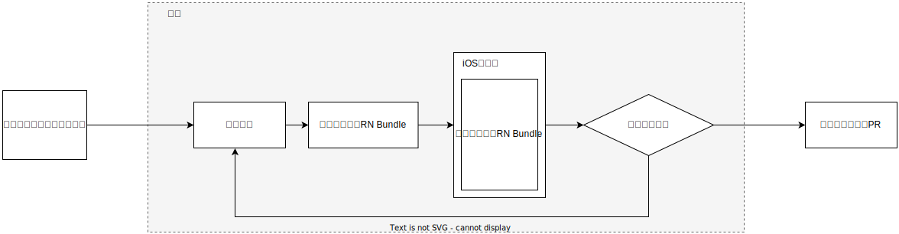
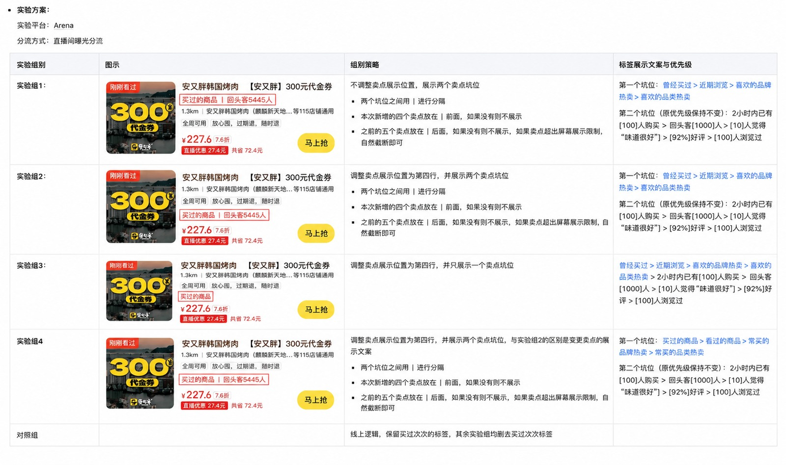
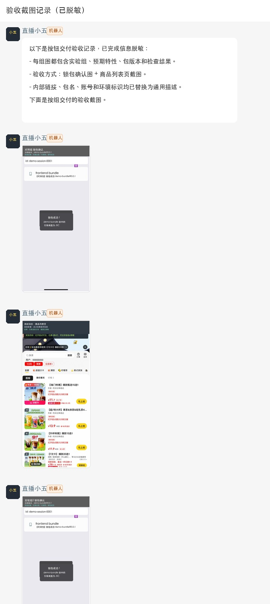
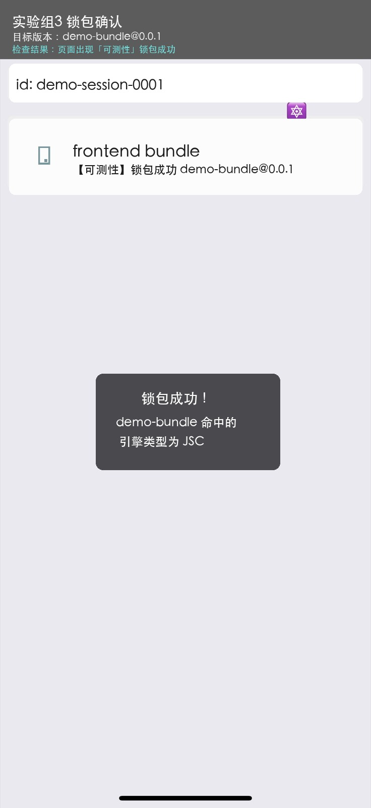
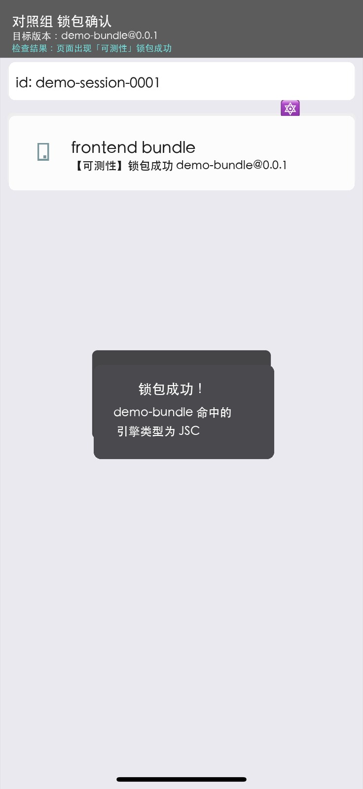
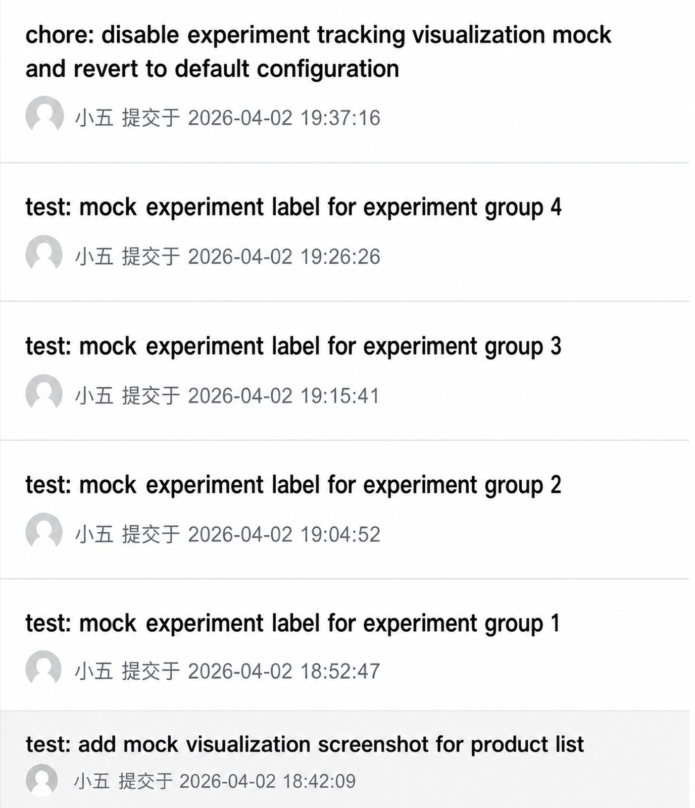

# AI 实习生“小五”：实战产品需求“卖点信息优化”

最近，我们选择了一个真实产品需求，交给 AI 自主编写代码、发包、验证。大约三五小时，就收到了全面的测试报告和PR。

这说明：只要给定明确的验收方式和标准，AI 就能想办法努力尝试直到通过所有用例，而不是生成一轮代码就停下来等人测试反馈。

## 目标需求

在【PRD】业务页面卖点信息优化需求中，需要对业务页面商卡的“红字”做4个实验组，对比效果。

### 交给小五去开发

此需求==验收标准明确==，先前我们也已给 AI 建设了相关打包、锁包、自测的技能及环境，直接拉群交给小五：

一大坨啰嗦的文字里，其实就是给小五同步了一些前后端 RD 线下讨论的信息：

| 类型 | 内容 |
| --- | --- |
| 产品信息 | 【PRD】业务页面卖点信息优化 |
| 技术信息 | - 前端、后端分工：前端负责“红字”位置，后端负责“红字”内容  - 实验接口：goodslist.bin:data.abTestConfig.userGoodsLabel = 'shiyanzu1' \| 'shiyanzu2' \| 'shiyanzu3' \| 'shiyanzu4' \| 'duizhaozu' \| 'doudizu' |
| 验收方式 | Mock实验接口字段，然后打包、锁包、进入业务场景、截图看货架商卡 |

### 大概三五小时后

小五给出了包含它执行的用例截图，每张图也标注了相关实验信息：

| 实验组1 | 实验组2 | 实验组3 | 实验组4 | 对照组 |
| --- | --- | --- | --- | --- |
|  |  |  |  |  |

在我们确认后，也让它提出了 PR。

我们人工 Review 后发现它的 PR 代码质量和 Commit 历史都非常规范漂亮，有非常周全的入参检查和类型守卫，远超我们对小五预期的 L5 水平。

比如实验和 Mock 代码：

成本上，整个任务使用了 GPT-5.4-Medium 共计 147k Token，激进上估计约使用了 ChatGPT $20 月套餐周限的 20%，折合成本 $1。

## 发现&思考

### 为什么小五能做到？

- **提供完整信息：**在现有组织分工下，需求的全量信息散在了流程上的不同角色里，所以需要==人类开会凑足全量的信息==

- **可验证的环境：**目前的 AI 有着顶级的白板编程能力，假设 AI 一次写对成功率是 70%，那我们给它一个自测的环境允许它尝试 3 次，成功率就能达到 97.3%，==就能将人从流程中剥离==

### 信息应该用什么形式提供？

在我们实践中发现，AI 对信息形式的要求并没有那么高，无论是纯文本、Markdown、在线文档、甚至很啰嗦的语音转录…

只要信息本身充分、不自相矛盾，AI 都能很好理解。

### 为什么不直接“一句话需求”？

AI 表现优秀的“一句话需求”，其实是因为这个需求的全量信息用一句话的长度就能说完。

而复杂需求，则是复杂在它需要==人类去调查收集==真实世界里那些跨小组、跨部门的信息。

### 未来的研发流程可能会是怎样？

AI 大幅降低开发成本后，人类的评审会变成最贵的环节。与其花时间争论哪个方案好，不如 AI 先干、人类再评。

### 人类的调测工具对 AI 可能不是必要的？

==人类写代码很慢==，所以人类倾向尽量保持代码不动，用各种外部工具断点、抓包、注入 Mock。

所以人类教 AI 时，也会想把自己顺手的方式教给它。

但实践中我们发现，AI 不一样。AI 就是为代码而生，它是 Token 世界的神。

它能轻易在成千上万行代码里精准写死 Log/Mock 数据然后提交打包，清晰的 Git 记录也让后续很好清理。这就是 AI 最舒服、最得心应手的方式。

不需要考虑两三个调试进程状态同步、七八个啰嗦工具调用。就比如，在这次需求中，AI Mock 接口 Commit：

人顺手的，不一定 AI 顺手的。

> 最近我们观察到，本地开发环境对 AI 似乎都没那么重要：顶级模型写代码几乎一次过

### 小五能自主运行多长时间？

目前，小五能且将长期（6～12个月内）专注单 Agent 的三五小时级无人值守运行。

原因：

- 小时级运行在 2026 已是顶级模型的成熟能力区间，也是当前落后 6~12 个月国产模型的能力区间

- ==AI 干三五小时，近乎人类干三五天==，多数需求就落在这个工作量区间

- 至于周级别，则是近两月顶模厂商才开始拿开发编译器、浏览器等任务宣传，真实生产少有此类需求，也需要更多预算

最后，我们总是有工程手段来优化 AI 工具脚本的执行时间，持续提高三五小时内的动作密度。

### 单 Agent 就够了？

我认为多数情况是的。

我们实践使用的是 200k 上下文的 GPT-5.4-Medium，其实已经很大——在不挥霍上下文的情况下：

- 减少任务前灌入三五千字的散弹枪规范；必要的规范后移到任务完成后，再 Review 改正，而不是事前虚空打靶让 AI 畏手畏脚

- 减少发明需要千字说明的定制工具，再按着 AI 头去用；而是仔细研究真实任务中 AI 的执行路径，卸载繁琐易错的动作序列到固定的脚本

- 减少养寇自重的黑话和架构设计、内部名词解释、设计模式解释、自创全局工具解释；而是给业务更合理的认知层级、给代码更局部的耦合方式

==回归常识==，给它干净、具体的例子、特化的测试步骤，它大概率就能很好做到。

### 先污染，后治理？

人类为什么要先学规范？因为人类写代码慢、返工贵，所以让人先学规范，总体生产成本更低。

但对 AI，前 100k 上下文是它的黄金注意力，不用来解决最主要的矛盾，暴殄天物。

而且事实证明，它真的很擅长重构：

- Claude Code 源码泄露后，几小时就被重构到 Python、Rust…

- OpenAI 在博文也写道：“我们会定期运行一组后台 Codex 任务，扫描偏差、更新质量等级，并发起有针对性的重构 Pull Request…”

### 可以分享一下小五的架构、技能吗？

小五用都是最标准的 发布系统 CLI、xcrun simctl、 WebDriverAgent…

只是我们花了大量时间在那些无聊的工作上：反复追查 AI 工具调用路径，极致具体地给 AI 人工定制包含大量环境假设的、高度特化的、明确精简的文字和脚本。以至于它们几乎没有任何迁移价值。

开发 AI 应用是一种在有限的输入长度内 平衡各文本成分 以获取更好结果 的艺术。

我认为，只有真的无法解决==一级问题==时，才需要花精力去研究二级问题的补丁手段（如摘要、委派之类）。

> 你真的对模型前 100k 精打细算了吗？

## 其他思考

$1：但各家 Coding Plan 还在补贴阶段，真实 API 调用成本较此可能要上升 5 倍
97.3%：1 - (1 - 0.7)^3
