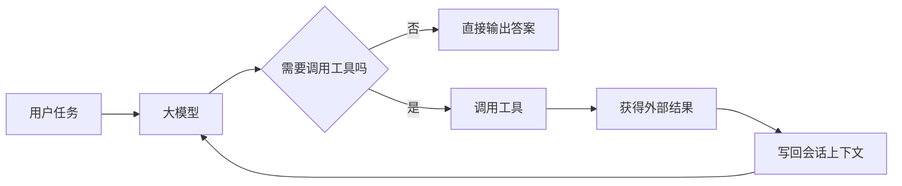
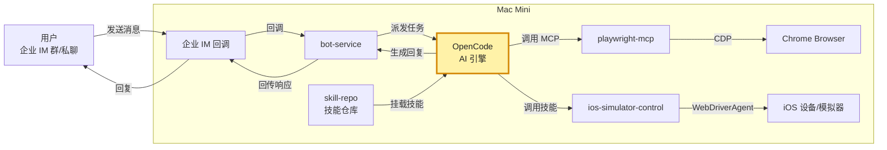
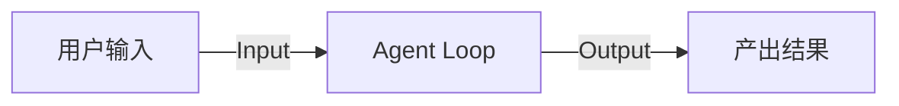

# AI 实习生“小五”：把 Agent 放进上下文已经存在的地方

## 开场

大家好，今天我想介绍的不是一个聊天机器人，而是一个在企业 IM 里工作的数字员工，名字叫 `小五`。

先从一句话定义开始，再解释它背后的架构和原理。

如果先用一句话定义它，那就是：

`小五` 是一个接入了企业 IM、拥有独立员工身份、可以调用真实工具和环境来完成任务的通用 Agent。

我今天主要讲 4 个问题：

1. 通用 Agent 到底是怎么工作的。
2. 为什么 `小五` 不是普通聊天机器人。
3. 为什么我们最后把它放进企业 IM，而不是单独做一个网页。
4. 这套做法为什么可以迁移到其他业务。

## 第一部分：通用 Agent 是怎么工作的

如果不先讲这个，后面很多关于 I/O、工具、技能、会话的讨论都会飘在空中。

我先用一张最小原理图说明通用 Agent 的工作方式。

这个循环通常叫做 `Agent Loop`，很多时候也会被叫做 `ReAct Loop`。

如果只用一句话解释 `ReAct Loop`，它的意思就是：模型一边推理，一边行动，再根据行动结果继续推理，直到完成任务。

这张图表达的就是一个最小的 `Agent Loop`。

它只想讲 3 件事。

第一，Agent 不是一次性吐一段文本，而是在一个循环里工作。

第二，这个循环一般是：理解任务，判断要不要调工具，调完工具拿到结果，再把结果带回模型继续推理，直到产出最终答案。

第三，真正让它从“会聊天”变成“会干活”的关键，不是 UI，而是它能不能进入这个循环，并拿到真实世界的反馈。

所以我更愿意把 Agent 理解成：

> 大模型外面包了一层会话管理、工具调用和执行控制。

如果只说标准代码 Agent 的最小能力，其实通常不用一下子讲得太复杂。

很多通用 Agent，最核心的工具往往就是这几类：

1. `Bash`
2. 文件读取
3. 文件写入或编辑

有了这几类基础工具，它其实就已经能完成很多真实任务。

至于技能，不是通用 Agent 必不可少的前置条件。技能更多是把一段已经验证过的流程，用文件和约定的方式沉淀下来，本质上仍然是建立在文件读写和工具调用之上的。

这一点如果想详细展开，可以直接参考 MiniMax 的这份说明：

[Mini-Agent README_CN](https://github.com/MiniMax-AI/Mini-Agent/blob/main/README_CN.md)

所以这里我不打算把技能体系展开太多，而是先把大家带到同一个理解上：Agent 的底座首先是模型、会话和基础工具。

如果再往上抽象一点，一个通用 Agent 可以看成 5 个部件：

1. 模型
2. 会话
3. 工具
4. 技能
5. 执行环境

模型负责推理，会话负责上下文，工具负责和外部世界交互，技能负责沉淀可复用流程，执行环境负责真的把事情做完。

到这里，大家就可以把各种 Agent 产品都先看成同一类东西的不同实现，而不是完全不同的物种。

## 第二部分：小五是什么

理解了通用 Agent 的工作方式之后，再回到 `小五`，事情就会清楚很多。

如果把这套东西落到我们自己的工程里，可以先看一张更具体的图：

这张图和前面第一部分正好可以接起来。

前面那张图讲的是通用 Agent 的最小工作原理，而这张图讲的是我们怎么把这套原理落成一个具体系统。

这里我特意把 `OpenCode` 高亮出来，因为它对应的就是第一部分讲的那个 Agent 核心循环。外围再由 `bot-service` 负责接入企业 IM、消息调度和回传，由 `skill-repo` 负责技能沉淀。

`小五` 的具象能力，我觉得可以先看 3 个：

1. 它可以在企业 IM 群聊和私聊里接任务，并持续承接上下文。
2. 它不只会回文本，还能调用浏览器、iOS 模拟器、本地开发环境去做事。
3. 它可以把常见工作流沉淀成技能，后面重复复用。

所以它和普通 Bot 的差异不在于“回复得更聪明”，而在于它真的能交付结果。

如果要下一句最短定义，那就是：

> 聊天机器人回答问题，数字员工交付结果。

`小五` 之所以不是普通聊天机器人，主要有 5 个原因：

1. 它不只是生成文本。
2. 它有真实工具可调用。
3. 它有长期会话可承接。
4. 它有独立身份和权限边界。
5. 它有技能可以重复执行。

## 第三部分：为什么 I/O 很重要

讲到这里，再回头看 I/O，位置就比较准确了。

这一部分我会先把第一部分的图再简化一下，只保留和 I/O 最相关的那层：

这张图的重点不是讲完整执行链路，而是单独讲清楚：什么叫 Agent 的 I/O。

所谓 I/O，本质上就是用户把任务和上下文输入给 `Agent Loop`，然后 `Agent Loop` 再把结果输出回来。

I/O 不是 Agent 的全部，它只是用户最直接感知到的那层表皮。

底层真正相似的，还是刚才那套：模型、会话、工具、技能和执行环境。

但也正因为底层相似，所以 I/O 会成为大家最先感知到的差异。

比如：

1. 终端型 Agent 的 I/O 在 terminal。
2. IDE 型 Agent 的 I/O 在编辑器、代码文件、diff、diagnostics。
3. IM 型 Agent 的 I/O 在 WhatsApp、TG、企业 IM、飞书这类消息流里。
4. 设计型 Agent 的 I/O 在画布、图层、选区和预览结果里。
5. 剪辑型 Agent 的 I/O 在时间轴、素材轨道和导出结果里。

所以更准确的说法应该是：

> Agent 最表层的差异，往往是 I/O 形式不同；但 I/O 背后接了什么工具、状态和执行环境，才决定它真正能做什么。

## 第四部分：为什么我们把它放进企业 IM

接下来就是我觉得这套方案里最有价值的一个产品判断。

我们最后把 Agent 放进企业 IM，不是因为“企业 IM看起来更方便”，而是因为 I/O 的位置会直接决定 Agent 能不能进入现有工作流。

如果一个 Agent 只存在于独立网页里，大家一般要多做 5 件事：

1. 记住一个新入口。
2. 学一套新的交互方式。
3. 手动复制上下文。
4. 手动转发结果。
5. 手动拉人协作。

这样它就很容易停留在“演示可用”。

但放进企业 IM之后，事情就不一样了：

1. 用户不用迁移习惯。
2. 任务天然发生在原本的沟通场景里。
3. 转发、拉群、@人、追问都是原生能力。
4. 上下文天然跟着群聊和私聊流转。
5. 结果直接回到大家本来就在使用的地方。

所以这里最重要的一句话是：

> 我们不是要求人迁移到 Agent，而是让 Agent 迁移到人原本的工作流里。

如果再说得更工程一点：

> 企业 IM不是一个聊天壳，而是组织内部的协作总线。把 Agent 接到企业 IM 里，本质上是把 Agent 接进了现有的消息流、任务流和协作流。

## 第五部分：我们的工程架构

接下来我讲一下 `小五` 的工程主干。

整个链路并不复杂，大致是这样：

1. 用户在企业 IM 群聊或者私聊里发消息。
2. 企业 IM 把消息回调给 `bot-service`。
3. `bot-service` 按聊天上下文派发任务。
4. `bot-service` 把任务交给 `OpenCode` 执行。
5. `OpenCode` 再去调用浏览器、iOS 模拟器、本地开发环境等工具。
6. 结果回传给 `bot-service`，再发回企业 IM。

如果压缩成一句话，就是：

> 企业 IM 负责协作场景，bot-service 负责接入、会话派发和回传，OpenCode 负责推理和执行，工具环境负责把任务真正做完。

## 第六部分：这套实现里最值得讲的几个工程点

### 1. 会话不是全局一个脑子，而是跟聊天场景绑定

这一点在 IM 场景里特别重要。

在我们的实现里，会话是按 `chatKey` 去承接的。这意味着：

1. 一个群聊有自己的上下文。
2. 一个私聊有自己的上下文。
3. 上下文天然跟协作场景绑定。

这也是为什么 IM 场景下的 Agent，会天然适合做长期协作。

### 2. 它不是所有消息都无脑回复

IM Agent 先要解决的不是“怎么回答”，而是“什么时候该说话”。

所以它会有：

1. @触发
2. 承接回复
3. `[[NO_REPLY]]` 这类抑制机制

这说明 IM Agent 的工程难点之一，其实是对话权控制。

### 3. 结果交付不是纯文本

`bot-service` 不只是转发一段控制台字符串，它还支持：

1. Markdown
2. 图片
3. 本地文件链接
4. @人

也就是说，它交付的是可用消息，而不是单纯一段文本。

### 4. 技能不是让模型变聪明，而是把流程产品化

`skill-repo` 里已经有很多很典型的技能：

1. `ios-simulator-control`
2. `live-test-suite`
3. `monorepo-repo-router`
4. `bus-release`
5. `bot-service-self-ops`

这里最关键的理解是：

> 技能不是魔法，它的本质是把成功 workflow 沉淀下来，让 Agent 下次不用从零开始。

## 第七部分：为什么一定要独立身份

这是我觉得这套方案里非常关键的一点。

`小五` 使用的是独立员工身份 `wb_zhiboxiaowu`，而不是借用某个真人账号去执行任务。

这样做的好处很直接：

1. 权限审批路径清晰。
2. 风险边界清晰。
3. 被拉进新群时不会默认继承操作者本人的权限。
4. 审计边界清晰。

所以它和很多“主人替身机器人”的差异，不只是实现方式不同，而是安全模型完全不同。

## 第八部分：我们为什么选择 OpenCode

在这套系统里，`OpenCode` 不是被当成一个单纯的 IDE 工具，而是被当成一个 Agent 引擎来使用。

我们最后选择 `OpenCode`，原因其实很直接。

第一，它是开源的。

第二，它有很好的会话管理，这对我们这种企业 IM 群聊和私聊场景特别重要，因为一个聊天场景天然就应该绑定成一个工作上下文。

第三，它有现成的 GUI，而且整体体验比较顺，方便查看和管理会话。

第四，它支持接入多家大模型供应商，这让底座不会被某一家模型能力或者接口形式锁死。

第五，它可以开启 `serve` 模式，SDK 也比较成熟，方便我们在外围再接 `bot-service`、`skill-repo` 这些自定义能力。

如果再往上说一层，我们并不是认为 `OpenCode` 和其他 Agent 产品在原理上有本质差异。

所有这类代码 Agent，底层其实都是 `Agent Loop`，差别并没有大到换了一个物种。

所以我们的选择逻辑也很简单：既然大家底层范式差不多，那就优先选一个代码质量高、界面好看、会话管理成熟、`serve` 模式可用、SDK 比较顺手的底座。

如果放到市面产品里看，也可以顺手把这些东西粗分成几类：

1. IDE / 终端型，比如 `OpenCode`、`Cloud Code`、`Cursor`。
2. 多渠道个人助理型，比如 `OpenClaw`。
3. 聊天工作区型，比如 `LobeChat`。
4. 强调自学习 / 自进化叙事的，比如 `Hermes Agent`。

## 第九部分：自我进化与 Hermes Agent

最近 `Hermes Agent` 很火，讨论度非常高。

如果把它放到更大的背景里看，很多人会拿它去和 `Claude Code`、`OpenClaw` 这类东西做比较。

其中它最容易被记住、也最容易被传播的卖点，就是“自我进化”。

所以这里真正要回答的问题不是“它火不火”，而是：它说的自我进化到底是什么，它和 `OpenClaw` 这种系统相比，到底多了什么。

我这里先说结论：

> `Hermes Agent` 和 `OpenClaw` 的差别，绝对不只是多了一句“自学习”的 system prompt。

根据 `Hermes Agent` 公开 README 和开发文档，它至少明确强调了这些能力：

1. 内建学习闭环，从经验创建 skill，并在使用中继续改进。
2. 持久记忆，持续沉淀 memory，并跨 session 搜索过去对话。
3. 用户建模，逐步建立对用户偏好和习惯的理解。
4. 多平台 gateway，Telegram、Discord、Slack、WhatsApp、Signal、CLI 等共用一套入口。
5. 调度与自动化，内建 cron scheduler。
6. 子代理与并行，可以 spawn isolated subagents。
7. 多种执行后端，local、Docker、SSH、Daytona、Modal 等。

如果和 `OpenClaw` 对比，我会这样总结：

1. `OpenClaw` 更像多渠道个人助理底座。
2. `Hermes Agent` 在这个底座上，进一步把 memory、skill、search、automation、subagent、self-improvement 叠得更厚。

所以更准确的说法是：

> `Hermes Agent` 不是只多了一个 prompt，而是把经验沉淀和持续改进做成了系统级能力。

这里可以顺势引一段最近流传很广的原文。那张推特图里最核心的话其实是：

> After completing a complex task (5+ tool calls), fixing a tricky error, or discovering a non-trivial workflow, consider saving the approach as a skill with skill_manage so you can reuse it next time.

如果把这句原文翻成更自然的中文，大意就是：

> 完成复杂任务、修 tricky error、发现非平凡 workflow 后，把方法保存成 skill，方便下次复用。

这句话之所以有传播力，是因为它把“自我进化”说得很像一句 prompt 就能触发的高级能力。

但如果真的往下拆，`Hermes` 的做法并不只是这一句提示词。

`Hermes Agent` 主仓库 README 里明确写了这些内容：

1. `creates skills from experience`
2. `improves them during use`
3. `nudges itself to persist knowledge`
4. `searches its own past conversations`
5. `builds a deepening model of who you are across sessions`

这已经说明它至少包含：

1. skill 持久化
2. 记忆写入
3. 会话检索
4. 用户建模

这已经说明它的“自我进化”至少包含 skill 持久化、记忆写入、会话检索、用户建模这些系统能力，而不是单独一句 prompt。

再进一步，它甚至还有单独的 `self-evolution` 项目。

`NousResearch/hermes-agent-self-evolution` 的公开 README 写得更直接：它会优化 skills、tool descriptions、system prompts，后续还计划优化 code，而且整个过程带有 evaluation dataset、execution traces、constraint gates、tests 和 PR review。

所以如果要简要分析它的原理，我会概括成三层：

1. 第一层，用 prompt 提醒自己在复杂任务后沉淀 skill。
2. 第二层，把记忆、skill、会话检索这些能力做成持久系统。
3. 第三层，再通过 evaluation、trace、优化流程去持续改进这些技能和提示词。

所以我最后会把它总结成一句：

> 那句 prompt 更像是“提醒自己沉淀经验”的最轻量入口，但 Hermes 真正宣传的自我进化，是一整套围绕 memory、skills、search、evaluation 和迭代优化展开的工程机制，而不是只有一句 prompt。

## 第十部分：把这个话题再落回小五

讲到这里，再回到 `小五`，我们的方向其实没有做得那么复杂。

我们走的是一种更直接、更克制、也更省 token 的路线。

我们没有去做一整套复杂的自进化框架，而是直接用本地 Git 仓库管理一些 `md` 文档，再配备少量脚本，把高频业务动作沉淀下来。

比如：

1. 发布系统 打包、锁包链接这类发布动作，对应业务仓库里的 workflow。
2. iOS 模拟器操作，对应 ios-simulator-control。
3. 获取业务场景链接，对应 room-link-query。

我们故意把这些脚本和说明包装得非常窄，只保留当前业务这一步真正需要的内容。

很多时候，一份说明可能就一两百字，多余的选择都不给 AI，避免它在模糊空间里乱选。

也就是说，我们不是在追求一个高度抽象、强泛化的“自动技能进化系统”，而是在做高度特化的业务流程沉淀。

从技能编写经验上看，我们总结下来的原则大概是这样：

1. 尽量围绕具体问题写，不追求空泛抽象。
2. 尽量把流程说明写得高度特化，直接对应当前业务动作。
3. 尽量减少不必要的分支和选择，避免模型在模糊空间里乱选。
4. 尽量把真正要执行的脚本入口收敛到最小，让每一步都短、准、直接。

这个做法未必有很强的泛化价值，但它非常实用，非常省 token，而且很适合真实业务先跑通。

所以我最后想强调的不是“我们也要做一个 Hermes”，而是另一种更克制的判断。

我觉得“自我演进”这件事现在还在一个很新奇的阶段，先不要追求大而全，而是一步一步来。

对我们来说，眼下更重要的不是构造一个宏大的自进化体系，而是先把真实业务里的高频动作稳定沉淀下来。

从这个角度看，我们现在做的事情其实很朴素：

> 给旧接口包一层 markdown UI，再把它交给 AI 去调用。

在这个基础上，我们已经有了几件很重要的东西：

1. 我们已经具备了技能沉淀的容器。
2. 我们已经有了经验记录，比如 `experience-notes`。
3. 我们已经有了真实工具、真实脚本和真实工作流。
4. 我们下一步真正值得做的，是继续把这些高频动作沉淀得更短、更准、更稳定。

## 收束

最后我想留下来的，不是某个概念词，而是这句话：

> 我们不是做了一个会聊天的机器人，而是把一个通用 Agent 工程化成了一个有独立身份、能在企业 IM 里协作、能调用真实工具交付结果的数字员工。

## 附录：参考依据

### 本仓库

1. `README.md`
2. `bot-service`
3. `skill-repo`

### OpenClaw

1. `v1.3.0` README: `warelay`
2. `v2.0.0-beta1` README: `CLAWDIS`
3. `v2026.1.5` README: `Clawdbot`
4. rename commit: `Moltbot -> OpenClaw`

### Hermes Agent

1. `NousResearch/hermes-agent` README
2. `NousResearch/hermes-agent` AGENTS.md
3. `NousResearch/hermes-agent-self-evolution` README
