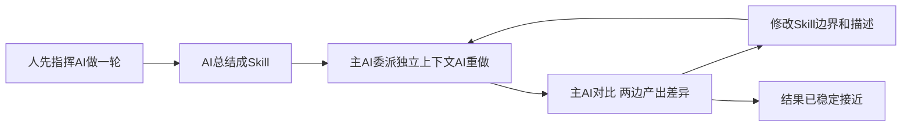

# 写一个稳定执行的 Agent Skill

目前大多编写 Skill 的做法是：

1. 人先指挥 AI 做一遍
2. 再把过程总结成一份 Skill

问题是，很多时候到这里就停了。  
这还不够，因为你并不知道这个 Skill 到底能不能真正驱动出结果。

更稳的做法是把它做成闭环：

1. 人先指挥 AI 做一遍
2. 让 AI 总结成 Skill
3. 主 AI 委派独立上下文的 AI 看着这个 Skill，基于任务原点再做一遍
4. 主 AI 对比独立 AI 产出和人指挥产出的差异
5. 再反过来改进 Skill

多迭代几轮后，Skill 才能从“看起来合理”变成“实际能用”。

## 具体例子

- AI 写出来的代码功能能跑
- 但防御性很强
- 注释啰嗦
- helper 职责混杂
- 变量、判断和使用点离得远
- PR diff 很难 review

问题明确之后，才进一步写出了 `readability-cleanup` 这个 Skill。  
但在写 Skill 之前，先没有急着总结，而是先人工把这件事一步一步收完。

以 `stableAlgorithmRecoGlobalId` 这条链路为例，人工实际做了这些事：

> - 把 `-999` 这类埋点约定下沉到埋点组装层
> - 让 helper 只返回真实结果
> - 把 early return 收直
> - 让 `rootTag` 取到后立刻判断
> - 去掉没有依据的多余防御
> - 去掉无收益注释
> - 把变量和判断尽量贴近使用点

这次人工一步步收敛的 commit 过程：

- [feature/algoGlobalId-new-clean commits](https://dev.sankuai.com/code/repo-detail/ssa/mlive-packages/commit/list?branch=refs%2Fheads%2Ffeature%2FalgoGlobalId-new-clean)

人工结果出来之后，再让 AI 总结成 Skill：

- 目标怎么写清
- 边界怎么卡住
- 默认动作怎么约定
- 哪些地方必须先检索，不能靠感觉删

然后再派独立上下文的子代理，只给任务原点和 Skill，让它重新做一遍。

把子代理重新做出来的结果和人工结果一对比，就能立刻看出：

- Skill 哪些地方已经够用
- 哪些边界还没写清
- 哪些判断其实必须先检索事实

这次补进去的内容就包括：

- 先收紧文件范围，再做局部收尾
- 删防御前先做代码检索，确认真实来源或写入点
- 只有 helper 职责边界变化真的影响直接调用方可读性时，才允许一起改调用方
- 默认不新增正式测试文件
- `mrn-live` 里必须跑 `bun run tscheck`

这样迭代几轮之后，`readability-cleanup` 才逐渐变成一份凝结了人类具体动作的 Skill。

最终写出的技能：

- [readability-cleanup / SKILL.md](https://dev.sankuai.com/code/repo-detail/mp-video-tech/m26/file/detail?path=fe%2Fc%2Fmrn-live%2F.agents%2Fskills%2Freadability-cleanup%2FSKILL.md)

## 核心思路

Skill 不是总结文档，更像给 agent 用的代码。  
agent 更像它的解释器 / 执行器。

所以 Skill 不能只写出来，还要做闭环验证：

- 人工先给出 exemplar
- AI 总结出 Skill
- 独立上下文的 agent 负责重新执行
- 主 AI 对比偏差
- 再用偏差改进 Skill

目标不是把 Skill 越写越全，而是把它收到最简、可执行。  
这里也要带着奥卡姆剃刀：能不加就不加，能合并就合并，能靠事实检索解决的，不塞进 Skill。

## 推荐步骤

1. 先人工做一轮  
   先指挥 AI 把真实任务做到自己满意

2. 再写 Skill
   再让 AI 总结成初版 Skill，把目标、边界、默认动作、验证方式收成短规则

3. 派独立子代理执行  
   只给 Skill 和任务范围，不把你人工已经收好的答案直接喂给它

4. 对比结果  
   看子代理哪里做到了，哪里开始跑偏

5. 用偏差修 Skill  
   - 边界不清，就补边界
   - 原则太虚，就补动作
   - 必须依赖事实判断，就写清“先检索再决定”
   - 能不新增规则就不新增，优先压回最简表达

6. 多来几轮  
   当子代理按照 Skill 已经能稳定做出接近人工结果的产物，Skill 就差不多了

## 怎么判断可以停

- 子代理已经能稳定做出接近人工结果的东西
- Skill 已经能约束改动范围
- 不会顺手扩 diff、顺手重构、顺手补测试
- 遇到删防御这类点，会先检索再判断
- Skill 没有越迭代越厚，留下来的规则仍然简洁
- 再继续改文案，收益已经明显变小

## 一句话

先人工做对，再抽象成 Skill，再让独立代理反复回放校验，最后用结果偏差反向修 Skill。
