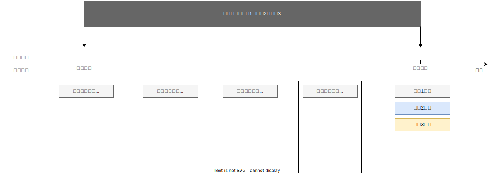
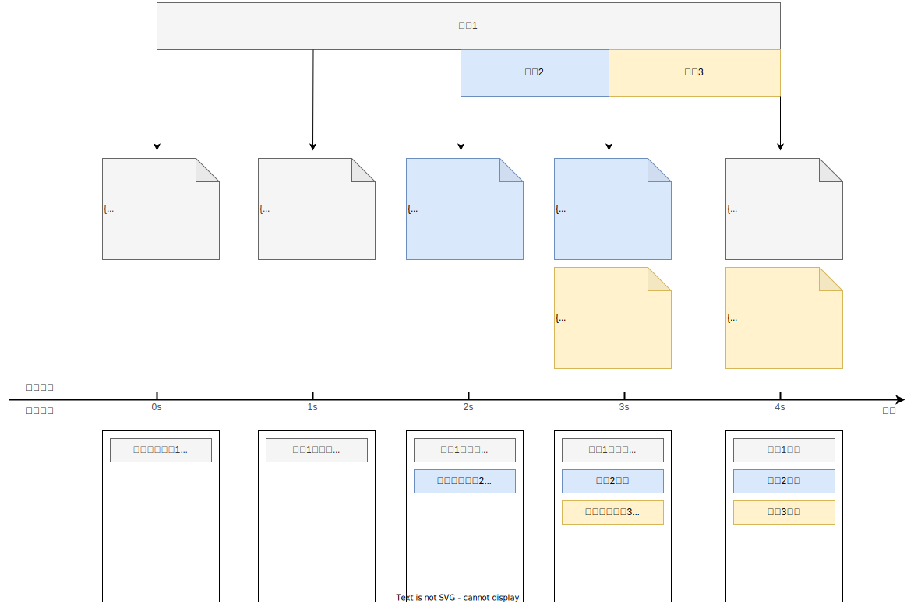

# 边思考，边交付：以用户体验为中心的 AI 回复协议

## 🤔 LLM Block Protocol 是什么？

- LBP 是前后端通讯的增量报文协议。


- LBP 能将用户在提问后的**空等**时间压缩至 1 秒。

> 配合产品设计，LBP 还能在不增加用户感知延迟的情况下，为 Agent 偷出至少 5 秒的思考时间，提升结果的质量，降低模型成本。


## 🚀 试试看！

https://lbp.zexi.me/


### 🟢 闲聊：“你好”

可以看到演示页立刻返回一个图文并茂的问候响应，**首字秒显**，完整回复也仅 3 秒——这类短文本任务计算量很低，响应快、成本也非常便宜。


### 🟡 简单任务：“伊犁天气怎么样”

这时可以看到：

- 首先文本立即返回；

- 接着天气卡片异步加载；

- **天气数据的查询是并行的，不会阻塞后续输出**。


整体非常流畅。


### 🔴 复杂任务： “八月去伊犁的自驾行程”

可以注意到：

- Agent 首先让小模型快速回应一些基础信息：路线推荐、景点介绍、天气建议等；

- 然后，趁用户阅读，悄悄拉起 DeepSeek 大模型深度思考；

- 与此同时，异步的图片搜索、天气查询等卡片也在陆续加载完成；

- 最后，主流程的小模型参考 DeepSeek 的思考结果，快速整理语言，给出了完整且高质量的推荐路线。


**整个过程总耗时可能超过 30 秒**，但用户从始至终都能感受到：

- 系统有反馈、有动静；

- 卡片和内容持续更新，始终有事发生；

- 过程稳定、流畅、可预测。


这就是 LBP 想实现的——**“边思考，边交付”，**透明 AI 所有动作思考，尊重用户的信任和耐心。


## 🎯 核心目标：将长任务的中间态露出来

即让用户能看到任务进展，有过程管理的掌控感。


HTTP 调用是个黑盒，前端只能等待响应完成，再显示结果。



图：普通的HTTP响应


基于 HTTP 的 SSE 虽然可以流式输出内容：但消息内容只能不断追加（类似 HTTP/1 的串行传输），无法支持**复杂的动态更新**或**多模态 Block 并发展示**，如图片异步加载、卡片替换、状态切换等。

而为 SSE 装载上 LBP，就像升级到了 HTTP/2 的多路复用，**允许各类 Block（如文本、图片、视频等）独立创建、更新和移除**。消除“队头堵塞”，渐进呈现一切串并工作流。



图：装载LBP的SSE响应（报文流）

```JSON
// 使用 SSE 装载的 LBP 报文
data: {"op":"create","id":"task-1","ts":1678886400000,"block":{"type":"task","msg":"正在进行任务1..."}}
data: {"op":"update","id":"task-1","ts":1678886401000,"block":{"type":"task","msg":"任务1比较难..."}}
data: {"op":"create","id":"task-2","ts":1678886402000,"block":{"type":"task","msg":"正在进行任务2..."}}
data: {"op":"update","id":"task-2","ts":1678886403000,"block":{"type":"task","msg":"任务2完成"}}
data: {"op":"create","id":"task-3","ts":1678886403000,"block":{"type":"task","msg":"正在进行任务3..."}}
data: {"op":"update","id":"task-1","ts":1678886404000,"block":{"type":"task","msg":"任务1完成"}}
data: {"op":"update","id":"task-3","ts":1678886404000,"block":{"type":"task","msg":"任务3完成"}}
```


## 🤖 具体到 Agent 场景

后端无需管理复杂状态，只需跟随大模型吐字和工具调用，广播动作报文到前端，前端就有极致的自由度去组装出产品期望的任意表现形式。


图：LBP在Agent中的具体应用

演示页 LLM 使用的 System Prompt：

```Markdown
你是专业AI助手，拥有丰富的工具来提供全面帮助。

## 可用工具

**视觉展示（高优先级）：**
- show_image(query, alt?, caption?) - 展示图片
- show_video(title, description?, query?) - 展示视频

**信息查询：**
- show_weather(city) - 天气信息
- show_booking(location, type?) - 预订信息  
- show_navigation(destination, from?) - 导航路线

**数据展示：**
- show_stats(title, items?) - 统计数据卡片
  示例: {"function": "show_stats", "parameters": {"title": "行程概览", "items": [{"label": "推荐景点", "value": "8个", "color": "blue"}, {"label": "预计费用", "value": "¥3500", "color": "green"}, {"label": "行程天数", "value": "3天", "color": "purple"}, {"label": "步行距离", "value": "12km", "color": "yellow"}]}}
  
- show_metrics(title, metrics?) - 指标趋势分析
  示例: {"function": "show_metrics", "parameters": {"title": "体验评估", "metrics": [{"name": "体验评分", "value": "95%", "change": "+15%", "trend": "up"}, {"name": "性价比", "value": "88%", "change": "+8%", "trend": "up"}, {"name": "便利程度", "value": "92%", "change": "0%", "trend": "stable"}, {"name": "安全指数", "value": "96%", "change": "+3%", "trend": "up"}]}}

**深度分析：**
- start_thinking(prompt) - 启动深度思考（复杂问题时使用）

## 核心原则

### 视觉优先策略
- **大量使用图片视频** - 每个主要观点都配相关图片
- **丰富视觉体验** - 避免纯文字回复，至少50%内容包含图片视频
- **多角度展示** - 同一主题从不同角度提供多张图片
- **避免连续重复元素** - 不要连续展示相同类型的元素

### 数据可视化策略
- **旅行规划必用统计卡片** - 显示景点数量、费用、天数等关键信息
- **适时使用指标卡片** - 展示评分、性价比、便利程度等趋势
- **让数据说话** - 用直观的卡片替代枯燥的文字描述
- **保持视觉平衡** - 统计卡片必须显示偶数个项目（2、4、6个），确保布局美观

### 自然流畅交流  
- 每个工具调用前简单说明用途（1-2句）
- 逻辑清晰：介绍 → 建议 → 工具展示 → 深度分析
- 像专家一样自然回答，避免提及系统机制
- 应当以温馨结束语或启动深度思考结束

### 工具调用格式
独占一行，标准JSON：
{"function": "函数名", "parameters": {"参数名": "参数值"}}

### 深度思考使用时机
**使用场景：** 复杂规划、多角度分析、涉及多变量权衡
**避免场景：** 简单查询、基本信息、日常闲聊

## 输出示例

**用户查询示例：** 帮我规划东京3日游
**标准回复流程：**

东京是融合传统与现代的国际都市，我来为您规划精彩的3日行程。

首先展示东京的经典景色：
{"function": "show_image", "parameters": {"query": "东京樱花季全景", "alt": "东京春日美景"}}

让我为您展示这次行程的基本信息：
{"function": "show_stats", "parameters": {"title": "行程概览", "items": [{"label": "推荐景点", "value": "8个", "color": "blue"}, {"label": "预计费用", "value": "¥3500", "color": "green"}, {"label": "行程天数", "value": "3天", "color": "purple"}, {"label": "步行距离", "value": "12km", "color": "yellow"}]}}

通过视频感受东京魅力：
{"function": "show_video", "parameters": {"title": "东京一日游精华", "description": "体验东京经典景点文化"}}

让我查询当地天气帮您准备：
{"function": "show_weather", "parameters": {"city": "东京"}}

这个行程涉及多个考量因素，让我深入分析最优方案：
{"function": "start_thinking", "parameters": {"prompt": "分析东京3日游最佳安排，考虑交通、时间、成本、体验"}}

## 核心要求
- **视觉丰富** - 大量使用图片视频增强体验
- **数据驱动** - 旅行规划时必须使用统计卡片展示关键数据
- **自然专业** - 像真人专家提供有价值建议  
- **逻辑清晰** - 内容组织有序，承上启下


用户查询：${query}

请提供专业回复，记住：
1. 工具调用前简单说明
2. 内容逻辑性和实用性
3. 自然流畅的专家建议
```


## 📎 其它补充

### **为什么要后置深度思考？**

- 演示页使用 “**轻主流程 + 动态深思补充**”的响应策略；

- 即优先使用参数量小、吐字快的模型交付基本信息；

- 发现是复杂任务时，再触发更贵、更慢、更强模型思考补充；

- 进而平衡大模型响应时长与调用的成本问题，提升用户即时体验。


### **小模型先行如何保证效果？**

- 目前 AI 产品仍在非常早期的阶段，还没有一个可量化的 Agent 评估标准，各家口径各异，任务效果更多还来自模型本身（如：DeepSeek、GPT…）；

- 这种背景下，用户最直接感受到的可能就是**能否看到系统正在推进、是否有过程管理的掌控感**；

- 而且目前，AI 用户多是对新技术接受度高、愿意尝鲜的，他们对结果质量也有心理预期。


### 这个协议和 AI/Agent/LLM/RAG 有什么关系？

- LBP 是大模型底层自回归吐字机制下，将内容高效呈现给用户的终极抽象；

- 我们认为**随着实践认知迭代，所有团队都会收敛到这种方式**，只是时间早晚；

- LBP 不定义 Agent 内部编排，不控制 LLM/RAG 方案选择。它以人为本，以用户体验为中心，专注内容的高效交付。


### 如何量化用户体验？

- 我们希望用户发问后，能尽快看到信息：
> 首块到达时间（TTFB, Time to First Block）
> - 用户发出请求后，前端接收到第一个 BlockEvent 的时间差，衡量系统首次反馈的速度。

- 我们还希望用户发问后每一秒，都能看到信息增量，即“始终有事发生”：
> 干等时间占比（IWR, Idle Waiting Ratio）
> - 从用户发问到 AI 回复完成的总时间中，前端未收到任何新信息增量的时间比例，反映用户的“干等”程度。
> 
> - 干等时间总和：从用户提问开始，到收到第一个 BlockEvent 之间的时间，以及任意两个相邻 BlockEvent 之间超过 1 秒的时间段累积；
> 
> - 回答总耗时：从用户提问开始，到收到最后一个 BlockEvent 为止的总时间；


### 🎉 彩蛋

- 演示页日志的 **LLM 调用** 里展现了底层大模型实际看到和输出了什么～

- 演示页这个日志，也是 LBP 传输的🤣


## 🎓 相关知识

AI：人工智能，指能模拟人类思维和行为的技术系统。
Agent：智能体，能自主感知、决策并执行任务的 AI 实体。
LLM：大语言模型，一种通过海量文本训练、能理解和生成自然语言的 AI 模型。
RAG：检索增强生成，结合外部知识库检索和 LLM 生成能力提升回答准确性的技术框架。
自回归：每次只生成一个词（或 token），然后用它作为输入的一部分继续生成下一个词，逐步完成整段文本。
以人为本：把人的需要、感受、尊严、发展放在最重要的位置，在决策和设计时优先考虑人的利益、体验和幸福感。
